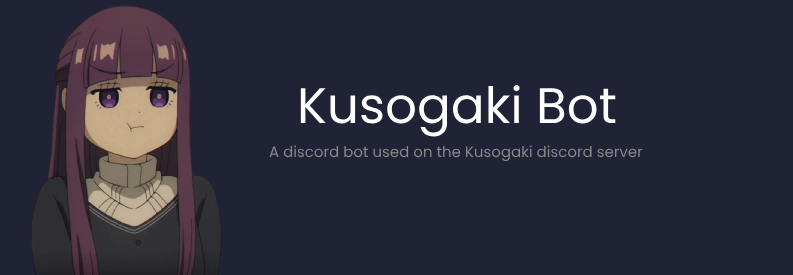

 

<h2> Bug report or Feature request </h2>

If you encounter a bug or have a feature request, please [create an issue](https://github.com/kusogaki-events/kusogaki-bot/issues), or create a support ticket on the [support channel in our discord server](https://discord.com/channels/1204428205675651122/1204814321029488660)

<h2> Want to Contribute? </h2>

Refer to [CONTRIBUTING.md](https://github.com/kusogaki-events/kusogaki-bot/blob/main/docs/CONTRIBUTING.md)

<h2> Commands </h2>

### GTA Quiz Game Commands
Base command: `gtaquiz` (alias: `gq`)
* `kuso gtaquiz start`: Start a new GTA quiz game
* `kuso gtaquiz join`: Join an ongoing game before it starts
* `kuso gtaquiz stop`: Stop the current game

### Poll Commands
> [!IMPORTANT]
> Poll commands are only usable by Kusogaki staff.

* `kuso poll <question> <duration> <multiple> <options...>`: Create a new poll
  * `question`: The poll question
  * `duration`: Duration in hours
  * `multiple`: Allow multiple choices (true/false)
  * `options`: Poll options (space-separated)
* `kuso endpoll <question>`: End an active poll
* `kuso listpolls`: List all active polls

### Reminder Commands
Base command: `reminder` (alias: `rem`)
* `kuso reminder set <time> <message>`: Set a new reminder
  * Time format: `1h30m`, `2d`, `30m`
  * Examples:
    * `reminder set 1h30m Take a break`
    * `reminder set 2d Check emails`
* `kuso reminder list`: List all your active reminders
* `kuso reminder delete <index>` (aliases: `del`, `remove`): Delete a reminder by its index number